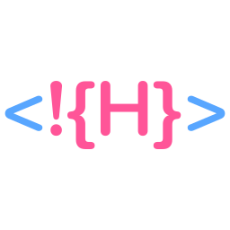

    
    

        Library for creating components and directives using HTML.
    
 

[//]: # ([![Build Status]&#40;https://github.com/syntax-framework/shtml/workflows/CI/badge.svg&#41;]&#40;https://github.com/syntax-framework/shtml/actions/workflows/ci.yml&#41;)
[//]: # ([![Documentation]&#40;https://img.shields.io/badge/documentation-gray&#41;]&#40;https://syntax-framework.com/shtml&#41;)

 

    
    <small align="center">
        sHtml is part of the Syntax Framework
    </small>

## Javascript

### Reactivity

**Concepts**

- **State** The variables of a component
- **Event** An external intervention, resulting from actions performed by the user, response to web requests or  triggering performed by other parts of the application, such as queues and topics
- **Expression** A block of executable code, a function
- **Action** An expression executed as a reaction to an event, which can modify the component's state
- **Watcher** Intercepts changes in the component state, being able to trigger new actions or schedule the execution of a DOM update
- **Writer** Applies the result of executing expressions through template interpolation to the DOM. Can modify texts, attributes of html elements and invoke parameter change of internal components

**Flow**

1. Events trigger the execution of an action
2. An action can modify the component state
3. State modification is captured and can trigger execution of new actions or schedule DOM updates
4. In the next Tick (RAF - RequestAnimationFrame), if necessary, the DOM will be updated with the new component state
